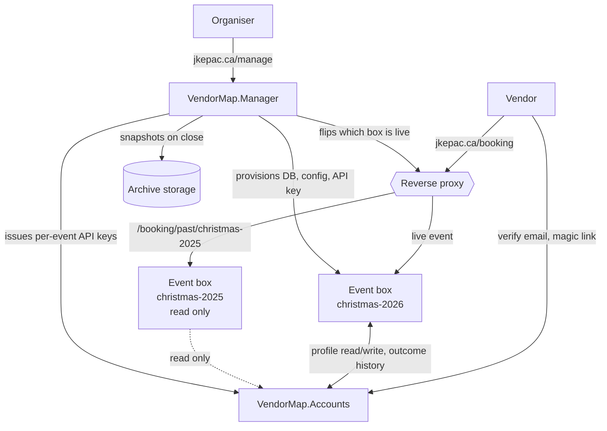

# VendorMap: three-service architecture

**Status:** proposal, nothing implemented. Supersedes the single-gate rework sketched in [TODO.md](TODO.md), which this design solves differently.

**Not before the 2026 market.** Everything here is 2027 work. No part of it should land while the November event is live.

## The idea

Split VendorMap into three deployable services instead of one application that holds every event.

| Service | Owns | Lifetime |
| --- | --- | --- |
| **VendorMap.Manager** | Deploying events, global settings, the registry of every event box | Permanent, one per organisation |
| **VendorMap.Event** | One event: floor plan, applications, approvals, bookings | Created per event, archived when it ends |
| **VendorMap.Accounts** | Vendor identity and cross-event history, the ground truth | Permanent, one per organisation |

An Event box is a self contained market. It is deployed by Manager, it runs, it finishes, it gets archived. Vendor identity does not live in it, so nothing important dies with it.

## Why split rather than cycle a single box

The single-box reset model had one unavoidable contradiction: "everything resets" and "returning vendors are remembered" cannot both be true of the same store. Splitting resolves it structurally. The Event box really can be thrown away, because the part worth keeping was never inside it.

Three further things fall out of the split:

1. **Concurrent events become possible again.** A spring fair box and a Christmas market box run side by side, reading the same Accounts service. A single cycling box could not do this.
2. **Approval is per event by construction.** There is no global approved flag to accidentally reuse. Being approved for the 2026 market is a row in the 2026 box, and it means nothing to the 2027 box.
3. **Passwords stop being the Event box's problem.** Authentication moves to Accounts, which is the single place a password reset (currently missing entirely) needs to be built.

## Architecture



## Service responsibilities

### VendorMap.Manager

The organiser's control panel, external to any event.

- Registry of every event box: name, dates, container status, database, mount path, and current lifecycle state (draft, staged, live, closed, archived).
- Deploy a new event: choose a name and dates, optionally copy a floor plan from a previous event, set booking rules and the AI guidance goal for this event, then provision.
- Provisioning means: create the database, run migrations, write the event's config (including a freshly issued Accounts API key), start the container, and add a proxy route for its staging path.
- Promote a staged box to live, which is a proxy change rather than a redeploy. See below.
- Close and archive: take a snapshot of the event box (database plus uploaded files), verify it, then either stop the container or leave it running read only.
- Global settings that every box inherits as defaults: SMTP, branding, Accounts service URL, AI guidance credentials and default goal, conditions document template.
- Owns organiser authentication. Today the admin login is a plaintext username and password in `config.php` checked against a session flag. Manager should replace that with a real account, and issue each Event box a scoped admin session rather than each box holding its own credentials.

### VendorMap.Event

The current application, with everything multi-event removed.

Keeps: the floor plan designer, the public booking flow, per event applications and approvals, table holds and payment tracking, the conditions document, category suggestions, AI vendor guidance.

Loses:
- The events list, event CRUD, and every event picker. The box knows what event it is from its config.
- The `users` table for vendors, and with it passwords, login, and the password reset that was never built. Vendor sessions come from an Accounts verified session.
- Global vendor records. `vendors` becomes `applications`, scoped to this event.
- `Event::slug` uniqueness and multi-event routing.

New local schema, roughly:

```
applications
  id
  account_profile_id      reference into Accounts
  profile_snapshot        json, the vendor's details as submitted to THIS event
  application_note
  status                  pending | approved | rejected
  admin_notes
  decided_at
  created_at, updated_at

event_tables
  ... unchanged, except vendor_id becomes application_id
```

The snapshot matters. Today the booking wizard writes changes back to the vendor's global profile, so editing a profile for next year silently rewrites what last year's records appear to say. Storing what was submitted to this event fixes that, and it also means bookings keep working when Accounts is unreachable.

### VendorMap.Accounts

Ground truth for vendor identity. Deliberately small, and deliberately not an approval authority.

Holds:
- One profile per business, keyed by verified email: business name, contact name, phone, address, website, socials, categories, verification artifacts.
- History: one row per application to any event box, with the outcome and the deciding organiser's note.
- Organiser-set standing: normal, favourite, do not accept. Advisory only. It never blocks anything by itself, it just shows up prominently when that vendor applies again.

Does not hold: approvals, bookings, tables, payments, or anything event shaped. Those belong to the Event box that owns them.

## Addressing: one URL that never changes

Vendors, posters, emails and bookmarks all point at a single address, and it stays the same every year:

```
jkepac.ca/booking                            the live event, always
jkepac.ca/booking/past/christmas-2026        last year, read only
jkepac.ca/booking/past/christmas-2025        the year before, read only
jkepac.ca/booking/preview/christmas-2027     staged, organisers only, before go live
jkepac.ca/manage                             Manager, organisers only
jkepac.ca/accounts                           Accounts, public only for magic link click through
```

No per event subdomains. Nothing about the public address changes from one market to the next, which matters because that URL ends up printed on things and pasted into school newsletters.

### Going live is a proxy flip, not a deploy

A new box is provisioned in the background and mounted at its preview path, where the organiser sets up the floor plan and checks it over. When they are ready, Manager changes one routing rule:

1. `/booking` starts serving the new box.
2. The outgoing box moves to `/booking/past/<its-key>` and switches to read only.
3. Deep links into the outgoing box get a redirect to their new path, so old emails still land somewhere sensible.

The useful property is that this is reversible. If the new box has a problem on the morning registration opens, flipping back is one action and no data has moved.

### What happens to old boxes

Each archived box has a visibility setting in Manager:

- **Public**, the default. Last year's market stays browsable at its `past` path. Good for showing vendors what the event looks like.
- **Organisers only.** Same path, but behind the Manager session. Use when you would rather last year's vendor list not be public.
- **Frozen.** The container is stopped and the path serves a static snapshot instead. Cheapest option if you do not want a container per past year running indefinitely.

### The detail that will bite

Running several boxes on one domain under different paths means they share a cookie namespace. Two Laravel apps both issuing a `laravel_session` cookie on `jkepac.ca` will collide, and the symptom is vendors being mysteriously logged out or seeing the wrong box's session.

Each box must set a session cookie name derived from its event key, and scope the cookie to its own mount path. This is a two line config change per box, and it has to be right in the very first deployment because the failure is confusing and intermittent rather than obvious.

## Identity: how sign-up actually works

This is the central design decision, and the recommendation is **passwordless verification through Accounts**.

The flow, from the vendor's side:

1. They land on the event box and click "Sign up for James Kennedy Christmas Market 2027".
2. They enter their email address.
3. Accounts emails them a link. The page says a link has been sent, and says nothing else. It does not reveal whether that address is known.
4. They click the link. Accounts verifies it and hands the event box a short lived, single use code.
5. The event box exchanges the code for the profile, and shows the application form with everything prefilled if a profile exists, or blank if it does not.
6. They review, correct anything out of date, add an application note, and submit.
7. The organiser approves or rejects that application, in that box, for that event.

Why this shape:

- **Prefill cannot leak.** The obvious alternative, prefilling as soon as a known email is typed, turns the public form into a lookup tool for other people's business address and phone number. Verification first makes that impossible by construction.
- **It removes passwords entirely.** There is currently no password reset anywhere in VendorMap, and under an annual cycle a meaningful share of returning vendors would arrive locked out. Passwordless sidesteps the whole category.
- **It reads as sign-up, not sign-in.** The vendor's mental model is "I am signing up for this market", which is accurate: they are creating an application. That the profile behind it persists is an implementation detail they never have to think about.

Google sign-in can stay as an alternative first factor, handled by Accounts rather than by each box.

## API between Event and Accounts

Server to server, over the internal network, authenticated with a per event API key issued by Manager at deploy time. Keys are scoped to one event and rotated on redeploy.

```
POST /api/v1/sessions/request
     {email, event_key, return_url} -> {status: "sent"}
     Always returns "sent", whether or not a profile exists.

POST /api/v1/sessions/exchange
     {code} -> {profile_id, email, profile: {...}, is_returning: bool}
     Single use, short expiry.

GET  /api/v1/profiles/{id}
PUT  /api/v1/profiles/{id}
     {business_name, contact_name, phone, address, website, socials, categories}
     Called when a vendor edits details during an application.

GET  /api/v1/profiles/{id}/history
     -> [{event_key, event_name, held_on, outcome, note, decided_at}]
     Outcomes: applied | approved | rejected | attended | no_show

POST /api/v1/profiles/{id}/history
     {event_key, outcome, note}
     Written when the organiser decides, and again after the event.

GET  /api/v1/profiles/{id}/standing
     -> {standing: normal|favourite|do_not_accept, note}
```

There is deliberately **no lookup by email endpoint**. The only way to reach a profile is through a verified session or a profile id the box already holds from an application. That single omission is what makes the privacy property hold.

## Event lifecycle

1. **Draft.** Organiser creates the event in Manager. Nothing is deployed yet.
2. **Stage.** Manager provisions the box at its preview path, optionally copying a floor plan from a previous event. Copied tables must reset to available, otherwise the new season opens with phantom bookings.
3. **Go live.** The proxy flip described above. `/booking` now serves this box and last year's moves to its `past` path.
4. **Open.** Registration opens, vendors apply, the organiser approves, approved vendors book tables.
5. **Run.** The market happens.
6. **Close.** Bookings and edits are locked. The organiser records attendance, which writes final outcomes back to Accounts.
7. **Archive.** Manager snapshots the database and uploaded files and verifies the snapshot reads back. The box keeps serving its `past` path read only, unless it is set to frozen, in which case the container stops and the snapshot is served instead.

Note what is missing from that list: there is no destructive step. Going live moves a box aside rather than deleting it, and archiving takes a copy. A box is only ever removed when an organiser explicitly deletes it in Manager, long after the fact, from a state where its contents already exist in Accounts as history and in the archive as a snapshot.

## Failure modes

Splitting into services introduces failures a single application does not have. The design should degrade in a specific order.

- **Accounts is down during sign-up.** New applications cannot start, because email cannot be verified. The event box shows a plain "sign-up is temporarily unavailable, please try shortly" message. This is acceptable: it is the only flow that hard depends on Accounts.
- **Accounts is down during booking.** Nothing happens. Bookings run entirely on the local application snapshot, by design. Vendors who are already approved keep working.
- **Accounts is down when an outcome is decided.** The approval succeeds locally and the history write goes into a local outbox, retried until it lands. Approvals must never block on a network call.
- **Manager is down.** Every live event box keeps running. Manager is only needed to deploy, configure, and archive.
- **An Event box is down.** Only that market is affected. Other boxes and Accounts are unaffected.

## Security and privacy

- Per event API keys, scoped and rotated at deploy. A compromised box cannot read profiles belonging to vendors who never applied to it.
- Accounts is the only service holding personal data long term, which makes deletion requests answerable in one place. Event boxes hold snapshots, so the retention period for archives has to be a stated policy rather than an accident.
- The one click approve link in signup emails is currently signed but never expires, and it addresses a vendor by row id. Under per event boxes those ids are reissued, so an old link would approve whoever now holds that id in a different box. Links must carry the event key and expire.
- `users.role` defaults to `admin` in the current migration. Any import or restore that inserts user rows without setting it explicitly creates administrators. If Manager ever restores an archive, this is a live privilege bug.
- Verification photos are currently loose files under `public/vphotos` with their URLs string appended into the application note. They should move to Accounts as proper attachments, or at minimum be archived with the box and have their URLs rewritten.

## Migration from today

The current install is one Laravel app with 1 event, 1 venue, 45 tables, 29 vendors, 32 user logins and 26 categories. That is small enough to move by hand if needed.

1. **Extract Accounts.** Build the service, seed it from the existing `vendors` table (29 profiles), backfill history from the current statuses.
2. **Point the existing app at Accounts.** Behind a flag, keep the local path working. The app is still monolithic at this stage, which keeps the change reversible.
3. **Strip multi-event from the app.** It becomes the Event box image. The 2026 install stays as it is, untouched.
4. **Build Manager.** Deploy the 2027 event as the first real box.
5. **Archive 2026.** Snapshot the existing install and retire it.

Steps 1 and 2 are the ones with real design risk. Steps 3 to 5 are mostly deletion and packaging.

## Effort and honest trade-offs

This is a rewrite, not a refactor. Weeks of work, not days, and it triples the number of things that can break at 2am before a market. Worth naming clearly:

- **Operational surface.** Three services, a reverse proxy, per box databases, and container orchestration replace one PHP application and one database. For a volunteer run committee that is a real ongoing cost.
- **A pragmatic middle.** Manager and Accounts can ship as one container with two modules at first, splitting later if it ever matters. The API boundary between Event and Accounts is what carries the design value. The container count does not.
- **The test suite is two example tests.** Nothing here should be attempted without real coverage, particularly around archive and restore.
- **What is genuinely won:** an Event box that is small enough to understand, concurrent events, per event approval that cannot leak across years, one place to fix passwords, and a vendor experience that improves rather than degrades on return.

## Open decisions

1. Does Accounts own organiser identity too, or only vendors? Manager owning organisers and Accounts owning vendors is cleaner, but means two identity stores.
2. What is the default visibility for an archived box: public, organisers only, or frozen? Public is friendliest and costs one idle container per past year.
3. Is Accounts single organisation, or does it become multi tenant so several organisations could share a deployment? That decision changes the profile schema significantly and should be made before step 1, not after.
4. Do vendors get a view of their own profile and history, or is Accounts purely behind the scenes?

## Non-goals

- Online payments. Payment stays offline and tracked per box, as today.
- Migrating the 2026 event into the new architecture. It finishes on the current code.
- Concurrent events inside a single box. That is the thing being removed on purpose.
